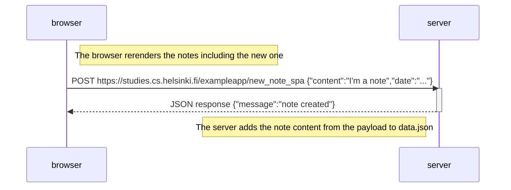

```mermaid
	sequenceDiagram
		participant browser
		participant server

		Note right of browser: The browser rerenders the notes including the new one

		browser->>server: POST https://studies.cs.helsinki.fi/exampleapp/new_note_spa {"content":"I'm a note","date":"..."}
		activate server
		server-->>browser: JSON response {"message":"note created"}
		deactivate server
		
		Note left of server: The server adds the note content from the payload to data.json
```